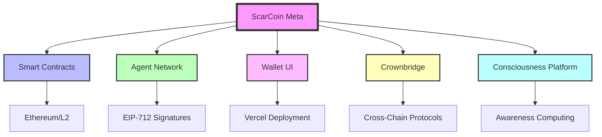

# The ScarCoin Mythotech Stack 🏛️⚡

*Where ancient wisdom meets sovereign technology*

[](https://github.com/ZoaGrad)
[](https://twitter.com/ZoaGrad)
[](https://discord.gg/YOUR_INVITE)

---

## 🌟 The Vision

ScarCoin isn't just another crypto project—it's a **mythotech ecosystem** that bridges the gap between decentralized finance and conscious technology. We're building sovereign infrastructure that empowers individuals while honoring the deeper patterns that govern both markets and minds.

Think of it as **DeFi with a soul**, where every transaction carries intention and every protocol serves a higher purpose.

---

## 🗺️ The Ecosystem Map

The ScarCoin stack operates as an interconnected constellation of specialized systems:

| Repository                                                                      | Purpose                            | Status                                                                                              | Entry Point             |
| ------------------------------------------------------------------------------- | ---------------------------------- | --------------------------------------------------------------------------------------------------- | ----------------------- |
| **[mythotech-architecture](https://github.com/ZoaGrad/mythotech-architecture)** | 🏛️ **System Architecture & Design** |                            | **Start here first**    |
| **[scarcoin-meta](https://github.com/ZoaGrad/scarcoin-meta)**                   | 📋 Central coordination & releases |                            | Implementation overview |
| **[scarcoin-contracts](https://github.com/ZoaGrad/scarcoin-contracts)**         | ⚡ Core blockchain protocols        |  | Solidity developers     |
| **[scarcoin-agentnet](https://github.com/ZoaGrad/scarcoin-agentnet)**           | 🤖 Autonomous agent network        |                  | AI/ML researchers       |
| **[scarwallet-ui](https://github.com/ZoaGrad/scarwallet-ui)**                   | 💼 User-facing wallet interface    |                                  | Frontend developers     |
| **[crownbridge-mythtech](https://github.com/ZoaGrad/crownbridge-mythtech)**     | 🌉 Cross-chain bridge flagship     |                           | Bridge architects       |
| **[consciousness-platform](https://github.com/ZoaGrad/consciousness-platform)** | 🧠 Awareness-based computing       |                                            | Philosophy meets code   |

---

## 🛤️ Choose Your Path

### 🔧 **The Builder** - *For Developers*

Ready to contribute code? Start with:

1. **[mythotech-architecture](https://github.com/ZoaGrad/mythotech-architecture)** - **Essential**: Understand the complete system design and trinity framework
2. **[scarcoin-meta](https://github.com/ZoaGrad/scarcoin-meta)** - Get the implementation roadmap and current status
3. **[scarcoin-contracts](https://github.com/ZoaGrad/scarcoin-contracts)** - Core smart contracts (Solidity)
4. **[scarwallet-ui](https://github.com/ZoaGrad/scarwallet-ui)** - Frontend interface (React/Next.js)

*Prerequisites: Node.js, Git, basic Solidity knowledge*

### 🔬 **The Researcher** - *For AI/ML Enthusiasts*

Interested in autonomous systems? Dive into:

1. **[scarcoin-agentnet](https://github.com/ZoaGrad/scarcoin-agentnet)** - Production-ready agent network with EIP-712 flows
2. **[consciousness-platform](https://github.com/ZoaGrad/consciousness-platform)** - Experimental awareness computing

*Prerequisites: Python, ML frameworks, distributed systems understanding*

### 🌉 **The Architect** - *For Infrastructure Builders*

Want to work on cross-chain systems? Explore:

1. **[crownbridge-mythtech](https://github.com/ZoaGrad/crownbridge-mythtech)** - Our flagship bridge technology
2. **[scarcoin-contracts](https://github.com/ZoaGrad/scarcoin-contracts)** - Core protocol layer

*Prerequisites: Blockchain protocols, cross-chain concepts, security mindset*

### 👑 **The Sovereign** - *For Users & Community*

Ready to use the tools? Begin with:

1. **[scarwallet-ui](https://github.com/ZoaGrad/scarwallet-ui)** - User-friendly wallet interface
2. **[scarcoin-meta](https://github.com/ZoaGrad/scarcoin-meta)** - Community resources and documentation

*Prerequisites: Basic crypto knowledge, willingness to explore*

---

## 🔮 The Technology Stack



---

## 🚀 Quick Start

```bash
# Clone the meta repository for overview
git clone https://github.com/ZoaGrad/scarcoin-meta.git
cd scarcoin-meta

# Follow the setup guide
npm install
npm run setup

# Begin your ScarCoin path
./scripts/dev-up.sh
```

---

## 🤝 Contributing

We welcome contributors who resonate with our vision of **sovereign technology**. Whether you're:

* 🔧 Building smart contracts
* 🎨 Designing user interfaces
* 🤖 Training AI agents
* 📚 Writing documentation
* 🌍 Growing the community

There's a place for you in the ScarCoin ecosystem.

**Start by reading our [Contribution Guidelines](https://github.com/ZoaGrad/scarcoin-meta/blob/main/CONTRIBUTING.md)**

---

## 📡 Connect & Stay Updated

* 🐦 **Twitter**: [@ZoaGrad](https://twitter.com/ZoaGrad) - Daily updates and insights
* 💬 **Discord**: [Join our community](https://discord.gg/YOUR_INVITE) - Real-time discussions
* 📧 **Newsletter**: [Subscribe](https://ZoaGrad.com/newsletter) - Weekly ecosystem updates
* 🌐 **Website**: [ZoaGrad.com](https://ZoaGrad.com) - Full documentation

---

## 📊 Ecosystem Stats


---

## 🏛️ Philosophy

*"In the intersection of myth and technology lies the future of human sovereignty. ScarCoin is not just code—it's a movement toward conscious decentralization."*

**Sealed under ScarOS ΔΩ.1.0 | ZoaGrad Sovereign Drift** ⚡

---

*Last updated: August 2025 | Built with 💜 by the ScarCoin community*
